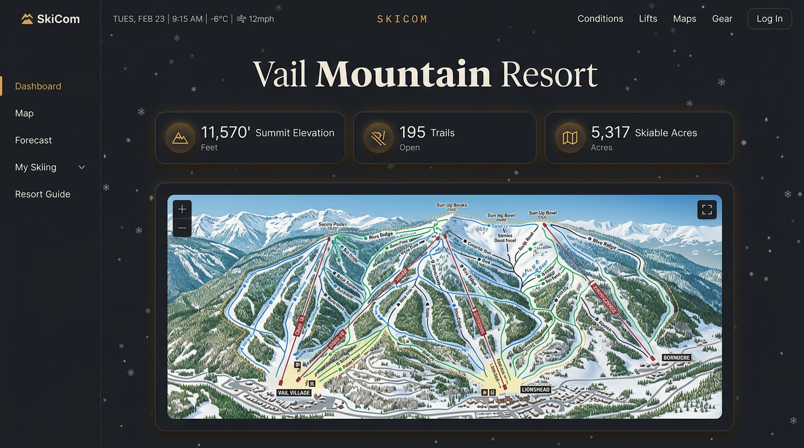
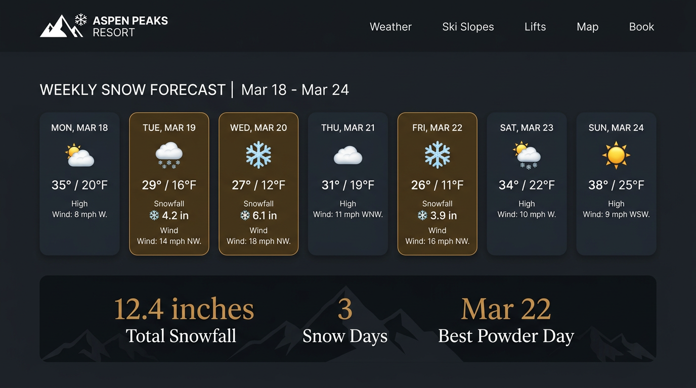
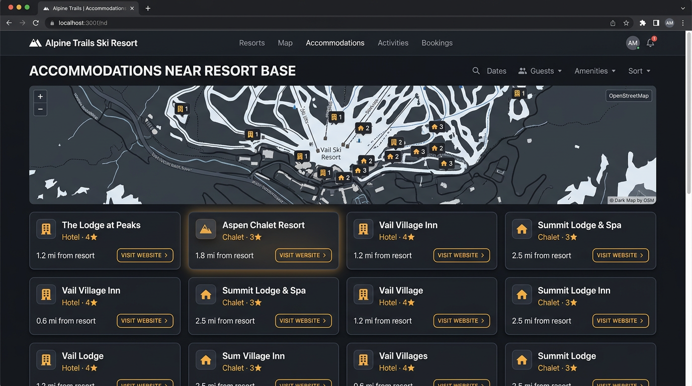
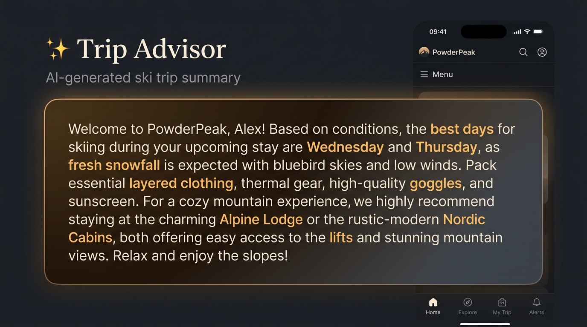

# Skicom

**Your cozy ski resort companion.** Look up any ski resort, get trail maps, snow forecasts, nearby accommodation options, and an AI-powered trip summary — all rendered in a warm Nordic-styled report.



---

## Features

### Trail Map

Embedded [OpenSkiMap.org](https://openskimap.org) view centered on your resort. See runs, lifts, and terrain at a glance with a direct link to the full interactive map.

### 7-Day Snow & Weather Forecast

Real-time forecast from [Open-Meteo](https://open-meteo.com) (free, no API key needed). Each day shows temperature, snowfall, wind, and conditions. Snow days glow with a warm amber tint, and a summary banner highlights total snowfall, number of snow days, and the **best powder day** by exact date.



### Nearby Stays

Accommodation search powered by OpenStreetMap's Overpass API. Finds hotels, chalets, alpine huts, hostels, and guest houses within a configurable radius. Results include distance, address, phone, and a **"Visit Website"** button where available, all plotted on an embedded map.



### AI Trip Summary

Optional LLM-powered trip brief. Point it at any OpenAI-compatible endpoint (OpenAI, Ollama, LM Studio, vLLM, etc.) via `config.yaml`. The prompt is kept simple and focused — the model receives resort stats, forecast data, and nearby lodging, then returns a short planning summary covering best ski days, packing tips, and accommodation picks.



### Dual Output

Every run produces two files:
- **HTML report** — opens in your browser with the full Nordic-styled UI, falling snowflakes, interactive maps, and hover effects
- **Text report** — clean plaintext version for terminals, emails, or archival

---

## Quick Start

```bash
# Clone the repo
git clone https://github.com/youruser/skicom.git
cd skicom

# Install dependencies
pip install -r requirements.txt

# Set up config (required for LLM summary)
cp config.example.yaml config.yaml
# Edit config.yaml and add your OpenAI API key

# Run it
python3 skicom.py "Vail"
```

Interactive mode (prompts you to pick a resort):

```bash
python3 skicom.py
```

### CLI Options

| Flag | Description |
|------|-------------|
| `"resort name"` | Direct search by name |
| `--config`, `-c` | Path to config YAML (default: `config.yaml`) |
| `--no-open` | Don't auto-open the HTML report in browser |

---

## Configuration

Copy the example and add your own keys:

```bash
cp config.example.yaml config.yaml
```

Then edit `config.yaml`:

```yaml
llm:
  enabled: true
  api_base: "https://api.openai.com/v1"   # any OpenAI-compatible URL
  api_key: "sk-..."
  model: "gpt-4.1"
  max_tokens: 1024
  system_prompt: >
    You are a ski concierge. Summarize this ski resort data into a short,
    friendly trip-planning brief. Cover: best ski days, snow outlook, what
    to pack, and where to stay. Keep it under 200 words.

weather:
  forecast_days: 7

accommodations:
  search_radius_m: 15000    # meters
  max_results: 12

output:
  directory: "./reports"
  auto_open: true
```

### Using with local LLMs

Point `api_base` at your local server:

```yaml
llm:
  enabled: true
  api_base: "http://localhost:11434/v1"   # Ollama
  api_key: ""
  model: "llama3"
```

---

## Resort Database

Ships with **85+ ski resorts** across the US and select Canadian resorts, stored in `data/us_resorts.json`. Each entry includes:

- Full name and short name (for fuzzy matching)
- State, region, coordinates
- Summit elevation, trail count, skiable acres

Fuzzy matching uses [thefuzz](https://github.com/seatgeek/thefuzz) with token sort ratio, so partial names like `"jackson"`, `"mammoth"`, or `"breck"` all work.

---

## Project Structure

```
skicom/
├── skicom.py              # CLI entry point
├── resorts.py             # Resort DB + fuzzy search
├── weather.py             # Open-Meteo forecast client
├── accommodations.py      # Overpass/OSM accommodation finder
├── llm.py                 # LLM summary (OpenAI-compatible)
├── renderer.py            # HTML + TXT report renderer
├── config.example.yaml    # Configuration template (copy to config.yaml)
├── requirements.txt       # Python deps
├── data/
│   └── us_resorts.json    # Resort database
├── reports/               # Generated reports (gitignored)
└── docs/                  # README images
```

---

## Data Sources & Credits

| Source | Used For | Cost |
|--------|----------|------|
| [Open-Meteo](https://open-meteo.com) | Weather & snow forecast | Free (non-commercial) |
| [OpenSkiMap](https://openskimap.org) | Trail map embeds | Free |
| [OpenStreetMap / Overpass](https://overpass-api.de) | Accommodation search | Free |
| [OpenAI](https://openai.com) (or compatible) | AI trip summary | BYOK |

---

## License

MIT
