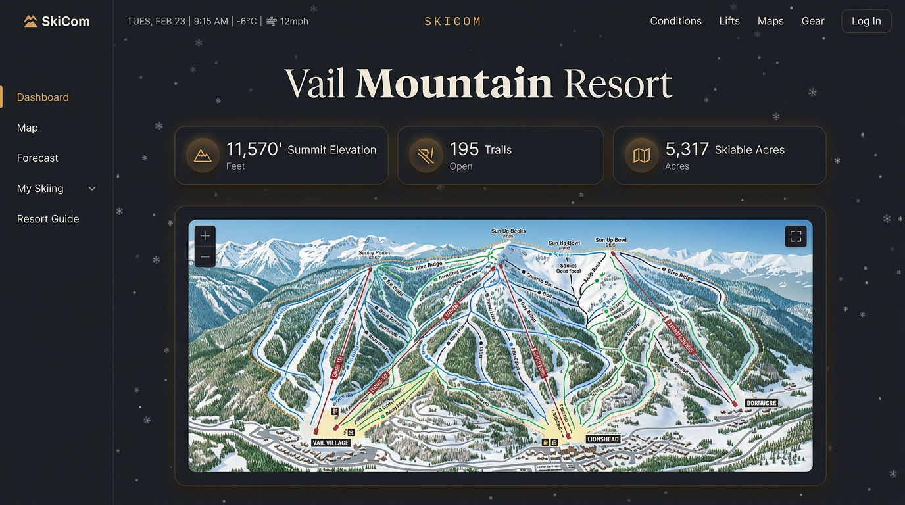
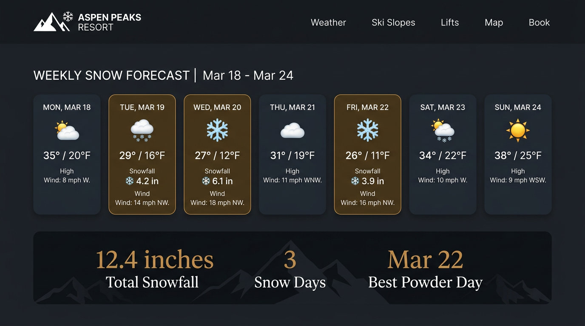
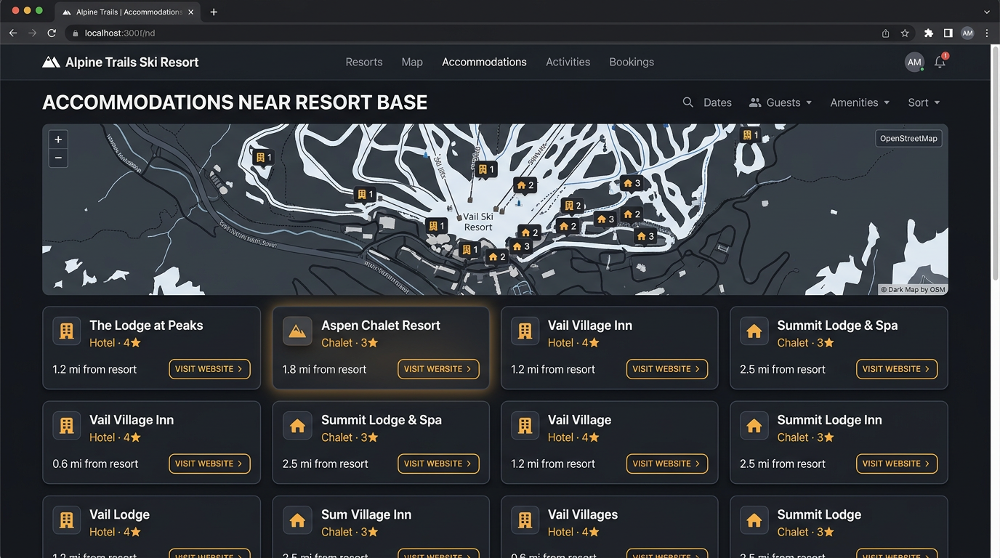
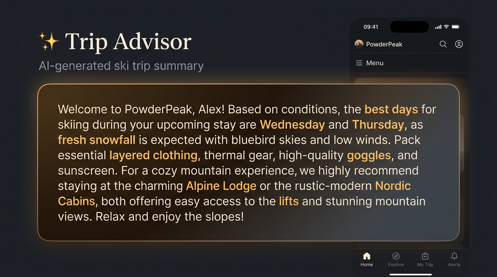

<div align="center">

# Skicom

### `a native ski-trip planner for your Mac — it runs entirely on your machine, never a browser tab on someone else's server.`

[](#resort-database)
[](#build-the-mac-app)
[](#license)
[](#quick-start)
[](#stack)

**Double-click an app. 527 resorts, 22 countries, global. Trail maps, snow forecasts, charts, lodging, and an opt-in AI brief — all on your machine.**

```bash
./mac/build_app.sh        # → Skicom.app on your Desktop. Double-click. Done.
```

</div>



---

## Contents

- [Why Skicom](#why-skicom)
- [What You Get](#what-you-get)
- [Quick Start](#quick-start)
- [Build the Mac App](#build-the-mac-app)
- [The Home Screen](#the-home-screen)
- [Map Mode](#map-mode)
- [Reports](#reports)
- [Terminal (`skicom`)](#terminal-skicom)
- [Config & Secrets](#config--secrets)
- [Resort Database](#resort-database)
- [Tests](#tests)
- [Stack](#stack)
- [License](#license)

---

## Why Skicom

You `grep` logs before breakfast. You think in pipes. You'd mass-rename 400 files before you'd open a GUI.

But when Friday rolls around and the forecast whispers *powder* — you're stuck scrolling ad-heavy resort sites, juggling six weather tabs, and comparing hotels like it's 2005.

**Skicom fixes that.** It's a real, native macOS app: a cozy desktop window over a tiny Python **standard-library** server that binds to `127.0.0.1` and nothing else. There's no website, no cloud, no account, no telemetry — it runs **entirely on your machine**.

> a trail map + a 6-day snow forecast + inline charts + nearby stays + an opt-in AI trip brief → one native window

No ads. No tracking. Open source, open data. This is how skiers who write code plan trips.

---

## What You Get

**A native local window.** A real `Skicom.app` you double-click. Under the hood it's a [pywebview](https://pywebview.flowrl.com) desktop window wrapping a Python standard-library HTTP server bound to `127.0.0.1`. Local only — never served to the network, never a browser tab on someone else's box.

**Trail maps & a 6-day snow outlook.** An interactive Leaflet trail/stays map plus a 6-day forecast straight from [Open-Meteo](https://open-meteo.com). Snow days glow amber, the best powder day is pinned by exact date, and the snow depth (base) sits right alongside.



**Inline charts, no JS chart libraries.** Hand-rolled inline SVG: a temperature trend, a snowfall bar chart, and a snow-depth chart. The whole week, readable at a glance.

**Nearby stays.** Hotels, chalets, and hostels pulled live from [OpenStreetMap](https://www.openstreetmap.org) via Overpass, plotted on an interactive map. Distance, address, phone, and a "Visit Website" button. Lookups fall back to a second Overpass mirror, so one flaky endpoint won't sink your search.



**An opt-in AI brief.** An "AI Suggest" button on each report. It's **off by default** — click it to generate a one-paragraph plan (best ski days, what to pack, where to sleep) from any OpenAI-compatible LLM. Your key never leaves your machine.



**A look you'll actually want to open.** A warm Nordic palette in [Hanken Grotesk](https://fonts.google.com/specimen/Hanken+Grotesk), an Apple-minimal layout, a light/dark theme toggle, and a few cozy pixel-art touches.

> **Heads up:** the screenshots above were captured on an earlier theme and may not match the current warm light/dark look — but the layout is the same.

---

## Quick Start

You'll probably want the [Mac app](#build-the-mac-app) — but everything starts the same way:

```bash
git clone https://github.com/KumaKuma2002/Skicom.git && cd Skicom
python3 -m venv .venv && source .venv/bin/activate
pip install -r requirements.txt
```

That's it. No config, no API keys. The AI brief is optional (see [Config & Secrets](#config--secrets)).

Then pick how you like to launch:

```bash
./mac/build_app.sh            # build a double-clickable Skicom.app (macOS)
python3 skicom.py --app       # open the native window right now
python3 skicom.py --serve     # open the home screen in your browser instead
python3 skicom.py "Mammoth"   # or skip the UI — generate a report from the CLI
```

> **Windows / Linux?** There's no native bundle, but `--serve` and the CLI work everywhere Python does.

---

## Build the Mac App

Want Skicom a double-click away? Build a real, self-contained Mac app:

```bash
./mac/build_app.sh
```

This drops **`Skicom.app`** onto your Desktop. It's **self-contained**: the bundle carries its own Python virtualenv *and* a copy of the app code inside `Skicom.app/Contents/Resources/app`, so it never reaches into your Desktop files — which means macOS privacy protection (TCC) can't break the launcher. Double-click it and a native Skicom window opens.

**First launch (unsigned app).** Because the app isn't notarized, Gatekeeper may block the first open. Either:

- **right-click** `Skicom.app` → **Open** → confirm the dialog, or
- run the helper to ad-hoc sign it and strip the quarantine flag:

  ```bash
  ./mac/sign_local.sh
  ```

  This is for **local use only** — it doesn't make the app distributable, it just lets *your* machine run *your* build without the nag screens.

The build also installs a **`skicom`** command on your `PATH` (see [Terminal](#terminal-skicom)). Logs from the windowed app go to `~/Library/Logs/Skicom.log`.

**Plan B — a fully-frozen build.** If you'd rather freeze the whole thing (no venv inside the bundle), there's a PyInstaller path:

```bash
./mac/build_pyinstaller.sh
```

Same result — a self-contained `Skicom.app` — built a different way.

---

## The Home Screen

When the window opens you land on a cozy home screen — warm Nordic palette, Hanken Grotesk, Apple-minimal. From here you can:

- **Search** — a live filter across resort names, regions, and countries as you type.
- **Browse by region** — pick a macro-region (Alps, Japan, Scandinavia, …) and drill down into its sub-regions and countries.
- **Featured** — a curated set of marquee mountains to start from.
- **Map** — a unique button in the upper-left corner that opens an interactive [map](#map-mode).
- **I'm Feeling Lucky** — jump straight to a random resort.
- **Theme toggle** — flip between light and dark; your choice is remembered.

Pick a resort and Skicom generates its full [report](#reports) on the spot.

---

## Map Mode

The upper-left **MAP** button opens a minimal, cozy map of the whole catalog:

- A clean [CARTO](https://carto.com/basemaps/) light/dark base that follows your theme.
- An [OpenSnowMap](https://www.opensnowmap.org) trails-and-lifts overlay — ski runs and lifts fade in as you zoom toward a mountain.
- Resorts shown as crisp pixel markers. Click one for a pixel-art info window with its elevation, vertical drop, lift count, and skiable acres — plus an **Open Report** button to dive in.

---

## Reports

Each report gathers everything for one mountain:

- **A 6-day forecast** with a snow summary and the best powder day pinned by date.
- **Inline SVG charts** — temperature, snowfall, and snow depth (no chart libraries).
- **An interactive trail/stays map** ([Leaflet](https://leafletjs.com)) centered on the resort.
- **Nearby accommodations** with distance, address, phone, and website links.
- **AI Suggest** — an opt-in button; the LLM brief is **off by default**, so nothing is sent anywhere until you click it. Bring any OpenAI-compatible model.
- A small **pixel-art back button** to return to the home screen.

---

## Terminal (`skicom`)

The build installs a `skicom` launcher on your `PATH`. (On first run it bootstraps the virtualenv for you.)

```bash
skicom                        # interactive picker
skicom "Zermatt"              # direct search → report
skicom --app                  # open the native desktop window
skicom --serve                # open the home screen in your browser
```

Or call `skicom.py` directly inside the repo:

```bash
python3 skicom.py                        # interactive picker
python3 skicom.py "Vail"                 # direct search
python3 skicom.py "Crystal Mountain WA"  # state hint to disambiguate
python3 skicom.py "breck"                # aliases work
python3 skicom.py --no-open "Stowe"      # generate without opening anything
python3 skicom.py --no-llm "Niseko"      # skip the AI brief
python3 skicom.py --app                  # native window
python3 skicom.py --serve                # browser home screen
```

---

## Config & Secrets

Everything works with **no config and no API keys**. The only optional piece is the AI brief.

To enable it, drop a `config.yaml` next to the code, or — handy for the bundled app, which has no working directory of its own — at `~/.config/skicom/config.yaml`:

```bash
cp config.example.yaml config.yaml
```

```yaml
llm:
  enabled: true
  api_base: "https://api.openai.com/v1"  # or http://localhost:11434/v1 for Ollama
  api_key: "sk-..."
  model: "gpt-5-mini"
  max_tokens: 4096
```

Any OpenAI-compatible endpoint works. Other settings — forecast days, accommodation search radius, output directory — have sensible defaults; see `config.example.yaml`.

> **Your key stays yours.** `config.yaml` (and `~/.config/skicom/config.yaml`) are git-ignored and are **never** copied into the `Skicom.app` bundle — so your key never lands in git or in the app. In the CLI, `--no-llm` skips the brief entirely.

---

## Resort Database

**527 resorts across 22 countries** — Skicom is global, not just North America:

- **The Alps** — France, Switzerland, Austria, Italy, Germany
- **Japan** — from Niseko to Hakuba
- **Canada** — coast to coast
- **Scandinavia** — Norway, Sweden, Finland
- **Pyrenees & Iberia** — Spain, Andorra
- **Eastern Europe** — Bulgaria, Czechia, Poland, Slovakia, Georgia
- **Southern Hemisphere** — Chile, Argentina, New Zealand, Australia (ski in July!)

…plus the full US lineup. Fuzzy matching with alias support, courtesy of [thefuzz](https://github.com/seatgeek/thefuzz):

```
"a-basin"       → Arapahoe Basin, CO
"smuggs"        → Smugglers' Notch, VT
"squaw valley"  → Palisades Tahoe, CA
"bachelor"      → Mount Bachelor, OR
"white pass WA" → White Pass Ski Area, WA
```

State and country hints (`", WA"`, `"washington"`) disambiguate when names collide. All of it lives in `data/resorts.json`.

---

## Tests

A self-contained, offline suite (no network) with 30+ checks covering resort data, weather parsing, rendering, and the server:

```bash
python tests/test_skicom.py
```

It also runs under `pytest tests/test_skicom.py` if you have pytest installed.

---

## Stack

| What | How | Cost |
|------|-----|------|
| Native window | [pywebview](https://pywebview.flowrl.com) | Free |
| Local server | Python standard library (`127.0.0.1` only) | Free |
| Weather & snow | [Open-Meteo](https://open-meteo.com) | Free |
| Maps & trails | [OpenSkiMap / OpenSnowMap](https://www.opensnowmap.org) + [Leaflet](https://leafletjs.com) | Free |
| Accommodations | [OpenStreetMap / Overpass](https://overpass-api.de) (dual-mirror) | Free |
| Resort search | [thefuzz](https://github.com/seatgeek/thefuzz) | Free |
| UI | Jinja2 + hand-rolled CSS + inline SVG charts | Free |
| AI brief | Any OpenAI-compatible API (opt-in) | BYOK |

*\*No API keys needed except for the optional, opt-in AI brief.*

---

## License

[MIT](LICENSE) — open source, open data. Plan freely.
